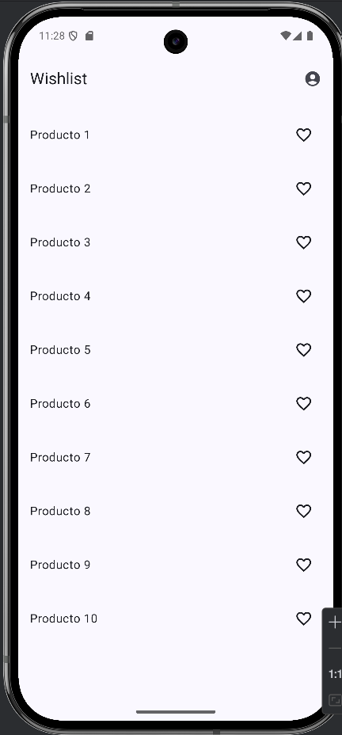
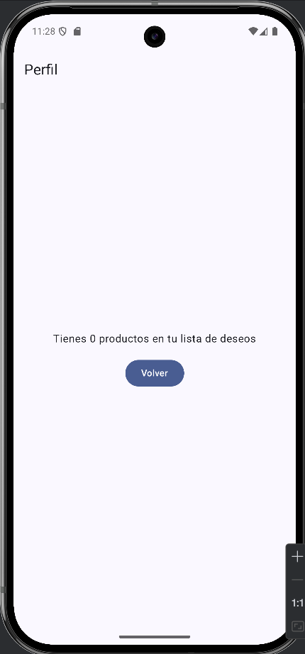
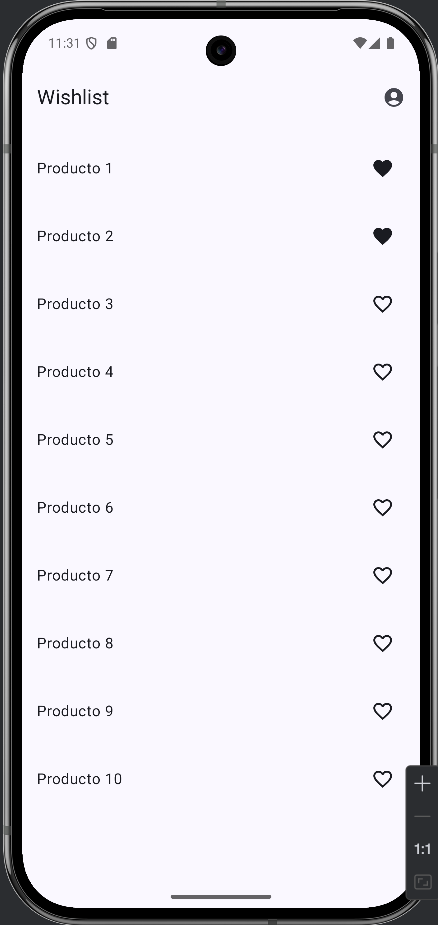
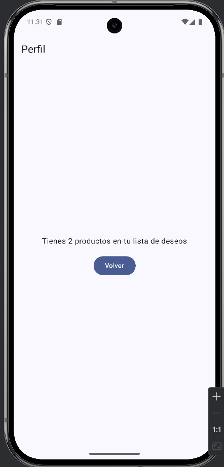
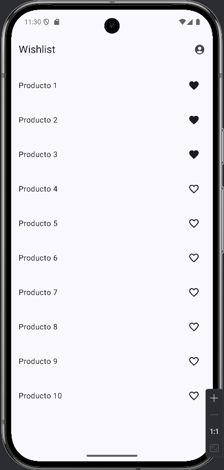
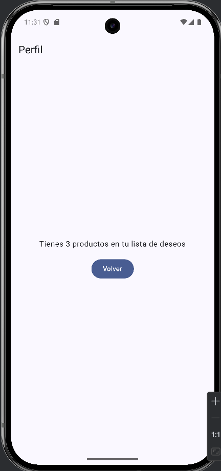

Explicación de la arquitectura:

La arquitectura se basa en MVVM con flujo de datos unidireccional. El ViewModel actúa como única fuente de la verdad: expone el estado de la UI y funciones para manejar intenciones del usuario. La View solo observa ese estado y emite eventos, no contiene lógica. El Model agrupa entidades y contratos de datos. Este desacoplamiento mantiene la UI reactiva y consciente del ciclo de vida.

El UiState es una instancia inmutable del estado de pantalla. Se modela como un objeto que reúne todos los datos que la UI necesita renderizar y se reemplaza completo cuando algo cambia, en lugar de mutarlo. Esta inmutabilidad elimina estados intermedios incoherentes, facilita pruebas deterministas y hace más predecible el renderizado al depender de un único valor observable.

La navegación se organiza con un grafo que define una ruta raíz y destinos. Asociar el ViewModel al back stack entry del gráfico raíz permite compartir estado entre pantallas hermanas sin pasar objetos pesados por argumentos. Los destinos consumen el mismo estado compartido y comunican intenciones a través de callbacks, así se evita acoplar navegación con lógica de dominio y se mantiene la fuente de verdad en el ViewModel.

Reflexión parte 1:

El estado no persiste porque Android considera que al rotar el teléfono, se está cambiando la configuración, esto activa el ciclo de la actividad onPause, onStop y onDestroy por lo que se crea una nueva activity con el onCreate y esta comienza una nueva composición. Si fuera una recomposición, el remember se mantendría, pero al ser una recreación esta se pierde. Ahora, si usamos un MVVM podemos hacer que los estados que tienen que mantenerse después de estos cambios de configuración como la rotación, se mantengan dentro del viewmodel.

Reflexión parte 2:

Cuando usamos el viewmodel resolvemos el problema de la parte 1, donde no se mantenía la cuenta de likes cuando se rotaba el dispositivo, porque en el viewModel el ciclo de vida de la cuenta no depende de la composición, sino que depende del viewModelStoreOwner. Es por es que, aunque rotemos la pantalla, se mantiene la memoria, porque android reutilizara el mismo viewmodel haciendo que los datos sean consistentes entre pantalla.

Reflexión parte 3:

Compartir un ViewModel entre destinos dentro de un mismo NavGraph ofrece ventajas significativas en el manejo del estado y la arquitectura general de la aplicación. En primer lugar, permite mantener una única fuente de la verdad para los datos que son relevantes en más de una pantalla. Esto asegura que las modificaciones realizadas en una vista, como marcar o desmarcar productos en la lista de deseos, se reflejen automáticamente en las demás pantallas que observan ese mismo estado, sin necesidad de sincronizar manualmente la información.
Cuando usamos el viewmodel resolvemos el problema de la parte 1, donde no se mantenía la cuenta de likes cuando se rotaba el dispositivo, porque en el viewModel el ciclo de vida de la cuenta no depende de la composición, sino que depende del viewModelStoreOwner. 
Es por eso que, aunque rotemos la pantalla, se mantiene la memoria, porque android reutilizara el mismo viewmodel haciendo que los datos sean consistentes entre pantalla. 

Además, al utilizar un ViewModel compartido, el estado de la aplicación se mantiene de forma más estable durante la navegación. No es necesario volver a crear objetos, recargar datos ni enviar información a través de argumentos de navegación. Esto mejora la eficiencia y reduce el riesgo de errores relacionados con la pérdida o duplicación de datos.

MVVM en el lab:

En la 2da parte del lab se utilizó el modelo MVVM para crear una app simple que funcionara como un wishlist para productos. Se definió la dataclass del producto en el domain/model y la lista con estos productos deseados se manejó dentro del WishlistViewModel, que funcionó como la única fuente de la verdad, gracias al MutableSateFLow privado que almacenaba la lista. Se utilizo el wishlistUIState, para manejar todos los datos que se necesitaban para renderizar las pantallas. Como se tenían las funciones para cargar productos y marcar un producto favorito dentro del Viewmodel, la logica del app se separa del UI. Por eso podemos la WislistScreen como el view, que solo necesita ver el estado sin la necesidad de manejar datos.

MVVM en el lab: 

En la 2da parte del lab se utilizó el modelo MVVM para crear una app simple que funcionara como un wishlist para productos. 
Se definió la dataclass del producto en el domain/model y la lista con estos productos deseados se manejó dentro del WishlistViewModel,  que funcionó como la única fuente de la verdad, gracias al MutableSateFLow privado que almacenaba la lista. 
Se utilizo el wishlistUIState, para manejar todos los datos que se necesitaban para renderizar las pantallas. Como se tenían las funciones para cargar productos y marcar un producto favorito dentro del Viewmodel, la logica del app se separa del UI. 
Por eso podemos la WislistScreen como el view, que solo necesita ver el estado sin la necesidad de manejar datos.  
